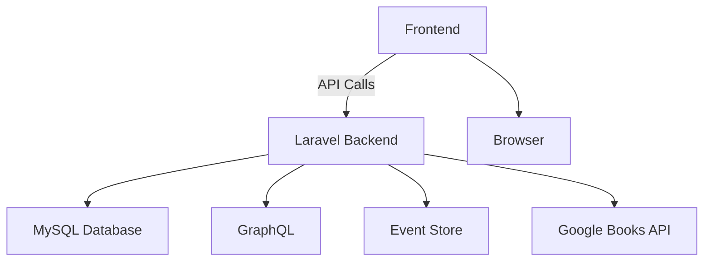
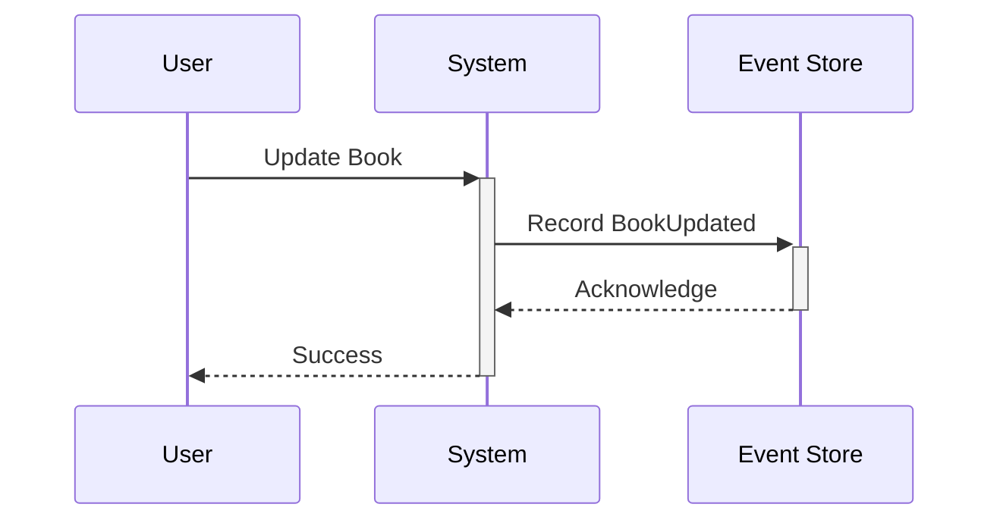

 # Library Management System


A comprehensive Laravel-based system with API and frontend for managing library operations. Includes **GraphQL API**, **Event Sourcing**, **Multi-Language Support**, **Reservations**, **Borrowing System**, and responsive frontend.

[](https://laravel.com)
[](https://php.net)

---

## Table of Contents

1. [Key Features](#key-features)
2. [System Architecture](#system-architecture)
3. [Installation Guide](#installation-guide)
4. [API Documentation](#api-documentation)
5. [Frontend Features](#frontend-features)
6. [GraphQL API](#graphql-api)
7. [Event Sourcing](#event-sourcing)
8. [Multi-Language Support](#multi-language-support)
9. [Testing](#testing)
---

## Key Features

### API Features
- **REST API**: Full CRUD operations for books, reservations, and borrows
- **GraphQL**: Flexible querying for all library data
- **Event Sourcing**: Complete audit trail for all changes
- **Multi-Language Support**: English & Arabic with auto-translation
- **Google Books Integration**: Enrich catalog with Google Books data
- **Recommendation Engine**: Personalized book suggestions
- **Export Capabilities**: Excel exports for all data

### Frontend Features
- **Book Management**: Browse, search, and manage books
- **Reservation System**: Place and manage reservations
- **Borrowing System**: Check-out and return books
- **User Dashboard**: Personalized user portal
- **Admin Panel**: Comprehensive management interface
- **Responsive Design**: Works on all devices

---

## System Architecture



---

## Installation Guide

### Prerequisites
- PHP 8.1+
- Composer 2.0+
- MySQL 5.7+
- Node.js 16+ (for frontend)

### Setup Steps

1. **Clone the repository**:
   ```bash
   git clone https://github.com/your-username/library-management.git
   cd library-management
   ```

2. **Install dependencies**:
   ```bash
   composer install
   npm install
   ```

3. **Configure environment**:
   ```bash
   cp .env.example .env
   php artisan key:generate
   ```

4. **Database setup**:
   ```bash
   php artisan migrate --seed
   ```

5. **Build frontend assets**:
   ```bash
   npm run build
   ```

6. **Start development servers**:
   ```bash
   php artisan serve
   npm run dev
   ```

Access the system at `http://localhost:8000`

---

## API Documentation

Full API documentation is available at `/api/documentation` after setup.

### Core Endpoints

| Resource     | Endpoint                          | Methods       |
|--------------|-----------------------------------|---------------|
| Books        | `/api/v1/books`                   | GET, POST     |
| Book         | `/api/v1/books/{id}`              | GET, PUT, DELETE |
| Reservations | `/api/v1/reservations`            | GET, POST     |
| Borrows      | `/api/v1/borrows`                 | GET, POST     |
| Users        | `/api/v1/users`                   | GET           |

### Special Endpoints
- `POST /api/v1/books/{id}/reserve` - Reserve a book
- `POST /api/v1/books/{id}/borrow` - Borrow a book
- `POST /api/v1/books/{id}/return` - Return a book
- `GET /api/v1/books/recommendations` - Get personalized recommendations

---

## Frontend Features

### Book Management


- Browse all books with pagination
- Advanced search and filtering
- Book details with availability status
- Admin CRUD interface

### Reservation System
- Place reservations for available books
- View reservation status
- Cancel reservations
- Reservation history

### Borrowing System
- Check-out books
- View due dates
- Renew books
- Return books

---

## GraphQL API

Access the GraphQL playground at `/graphql-playground`

### Example Queries

```graphql
# Get books with availability status
query {
  books {
    id
    title
    author
    status
  }
}

# Place a reservation
mutation {
  reserveBook(input: {
    book_id: 1
    user_id: 1
    reserved_until: "2024-12-31"
  }) {
    id
    status
  }
}
```

---

## Event Sourcing

All changes are recorded as events:



View event history at `/admin/events`

---

## Multi-Language Support

Switch between English and Arabic with automatic translation:

```php
// Example translation usage
__('messages.welcome'); // Returns based on current locale
```

Translation files located in `lang/{en,ar}`

---

## Testing

Run the test suite:

```bash
php artisan test
```

Test coverage includes:
- Unit tests for core logic
- Feature tests for API endpoints
- Browser tests for frontend
