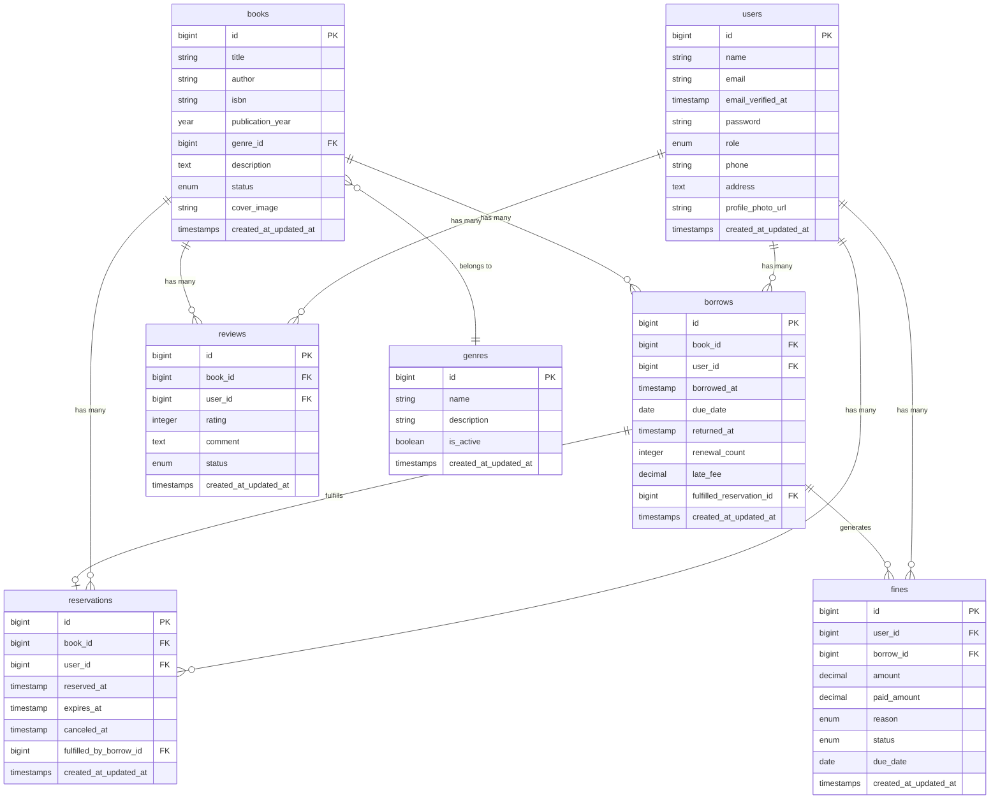

# Library Management System - Developer Guide

This comprehensive guide is for developers who want to understand, extend, or contribute to the Library Management System. It covers architecture, coding standards, development workflows, and best practices.

## Table of Contents

1. [Architecture Overview](#architecture-overview)
2. [Development Environment](#development-environment)
3. [Project Structure](#project-structure)
4. [Code Standards](#code-standards)
5. [Design Patterns](#design-patterns)
6. [Database Design](#database-design)
7. [API Development](#api-development)
8. [Frontend Development](#frontend-development)
9. [Testing Strategy](#testing-strategy)
10. [Performance Optimization](#performance-optimization)
11. [Security Considerations](#security-considerations)
12. [Deployment Guide](#deployment-guide)
13. [Contributing Guidelines](#contributing-guidelines)

## Architecture Overview

### System Architecture

The Library Management System follows a modern, layered architecture:

```
┌─────────────────────────────────────────────────────────────────┐
│                        Presentation Layer                        │
├─────────────────────┬───────────────────┬─────────────────────┤
│   Vue.js Frontend   │   Inertia.js      │   API Endpoints     │
│   - Components      │   - Page Props    │   - RESTful Routes  │
│   - Composables     │   - Form Handling │   - JSON Responses  │
│   - TypeScript      │   - SSR Support   │   - Authentication  │
└─────────────────────┴───────────────────┴─────────────────────┘
                                │
┌─────────────────────────────────────────────────────────────────┐
│                       Application Layer                          │
├─────────────────────┬───────────────────┬─────────────────────┤
│   HTTP Controllers  │   Form Requests   │   Middleware        │
│   - Route Handling  │   - Validation    │   - Authentication  │
│   - Request/Response│   - Authorization │   - Rate Limiting   │
│   - Error Handling  │   - Data Binding  │   - CORS Policy     │
└─────────────────────┴───────────────────┴─────────────────────┘
                                │
┌─────────────────────────────────────────────────────────────────┐
│                        Business Layer                            │
├─────────────────────┬───────────────────┬─────────────────────┤
│   Service Classes   │   Action Classes  │   DTO Objects       │
│   - Business Logic  │   - Single Purpose│   - Data Transfer   │
│   - Orchestration   │   - Commands      │   - Type Safety     │
│   - Transactions    │   - Queries       │   - Validation      │
└─────────────────────┴───────────────────┴─────────────────────┘
                                │
┌─────────────────────────────────────────────────────────────────┐
│                         Domain Layer                             │
├─────────────────────┬───────────────────┬─────────────────────┤
│   Models/Entities   │   Events          │   Observers         │
│   - Domain Objects  │   - Domain Events │   - Side Effects    │
│   - Relationships   │   - Event Sourcing│   - Notifications   │
│   - Business Rules  │   - Audit Trails  │   - Cache Updates   │
└─────────────────────┴───────────────────┴─────────────────────┘
                                │
┌─────────────────────────────────────────────────────────────────┐
│                      Infrastructure Layer                        │
├─────────────────────┬───────────────────┬─────────────────────┤
│   Database          │   External APIs   │   File System       │
│   - MySQL/Postgres  │   - Search Engine │   - Storage         │
│   - Migrations      │   - Email Service │   - Uploads         │
│   - Seeding         │   - SMS Gateway   │   - Backups         │
└─────────────────────┴───────────────────┴─────────────────────┘
```

### Technology Stack

#### Backend
- **Framework**: Laravel 12.x
- **Language**: PHP 8.2+
- **Database**: MySQL 8.0+ / PostgreSQL 13+
- **Cache**: Redis 6.0+
- **Queue**: Redis-based queues
- **Search**: Typesense for full-text search
- **Authentication**: Laravel Sanctum
- **Testing**: Pest

#### Frontend
- **Framework**: Vue.js 3.x
- **Language**: TypeScript 5.x
- **Build Tool**: Vite 5.x
- **Routing**: Inertia.js 1.x
- **Styling**: Tailwind CSS 3.x
- **State Management**: Vue Composition API
- **Testing**: Vitest & Playwright

### Design Principles

1. **SOLID Principles**: Single Responsibility, Open/Closed, Liskov Substitution, Interface Segregation, Dependency Inversion
2. **Clean Architecture**: Separation of concerns with clear layer boundaries
3. **Domain-Driven Design**: Business logic encapsulated in domain models
4. **Event-Driven Architecture**: Loose coupling through domain events
5. **API-First Design**: RESTful APIs that can serve multiple clients
6. **Test-Driven Development**: Comprehensive test coverage for reliability

## Development Environment

### Prerequisites

- PHP 8.2+ with required extensions
- Composer 2.0+
- Node.js 18+ with npm/yarn
- MySQL/PostgreSQL database
- Redis server
- Git version control

### Local Setup

```bash
# Clone repository
git clone https://github.com/AdilAzhari/library-api-12.git
cd library-api-12

# Install dependencies
composer install
npm install

# Environment setup
cp .env.example .env
php artisan key:generate

# Database setup
php artisan migrate --seed

# Start development servers
php artisan serve &
npm run dev &
```

### Development Tools

#### Required Tools
- **IDE**: PhpStorm, VS Code, or similar
- **Database Client**: TablePlus, phpMyAdmin, or Adminer
- **API Testing**: Postman, Insomnia, or HTTPie
- **Browser**: Chrome/Firefox with developer tools

#### Recommended Extensions (VS Code)
- PHP Intelephense
- Laravel Extension Pack
- Vue Language Features (Volar)
- TypeScript Hero
- Tailwind CSS IntelliSense
- GitLens
- Docker (if using containers)

### Environment Variables

Key development settings in `.env`:

```env
APP_ENV=local
APP_DEBUG=true
LOG_LEVEL=debug

# Development database
DB_CONNECTION=mysql
DB_HOST=127.0.0.1
DB_DATABASE=library_dev

# Queue and cache
QUEUE_CONNECTION=sync  # Use 'redis' for async testing
CACHE_DRIVER=array     # Use 'redis' for cache testing

# Mail (use log driver for development)
MAIL_MAILER=log

# Search (optional for development)
SCOUT_DRIVER=collection  # Use 'typesense' for search testing
```

## Project Structure

### Backend Structure

```
app/
├── Actions/                 # Single-purpose action classes
│   ├── BorrowBookAction.php
│   ├── ReturnBookAction.php
│   └── ProcessOverdueAction.php
├── Console/                 # Artisan commands
│   ├── Commands/
│   └── Kernel.php
├── DTO/                     # Data Transfer Objects
│   ├── BaseDTO.php
│   ├── BookCreateDTO.php
│   └── BorrowBookDTO.php
├── Enum/                    # Enumeration classes
│   ├── BookStatus.php
│   ├── UserRoles.php
│   └── BorrowStatus.php
├── Events/                  # Domain events
│   ├── BookBorrowed.php
│   ├── BookReturned.php
│   └── BookOverdue.php
├── Exceptions/              # Custom exceptions
│   ├── BookNotAvailableException.php
│   └── ReservationExistsException.php
├── Http/
│   ├── Controllers/         # HTTP controllers
│   │   ├── Api/            # API controllers
│   │   ├── Admin/          # Admin controllers
│   │   └── Auth/           # Authentication controllers
│   ├── Middleware/         # Custom middleware
│   ├── Requests/           # Form request validation
│   └── Resources/          # API resources
├── Models/                 # Eloquent models
│   ├── Book.php
│   ├── User.php
│   ├── Borrow.php
│   └── Reservation.php
├── Observers/              # Model observers
│   ├── BookObserver.php
│   └── BorrowObserver.php
├── Policies/               # Authorization policies
│   ├── BookPolicy.php
│   └── BorrowPolicy.php
├── Services/               # Business logic services
│   ├── BookService.php
│   ├── BorrowingService.php
│   └── ReservationService.php
└── Traits/                 # Reusable traits
    ├── ApiMessages.php
    └── HasUuid.php
```

### Frontend Structure

```
resources/
├── js/
│   ├── Components/         # Reusable Vue components
│   │   ├── Common/         # Common UI components
│   │   ├── Forms/          # Form components
│   │   └── Tables/         # Data table components
│   ├── Composables/        # Vue composition functions
│   │   ├── useApi.ts
│   │   ├── useAuth.ts
│   │   └── useBooks.ts
│   ├── Layouts/            # Layout components
│   │   ├── AppLayout.vue
│   │   ├── AuthLayout.vue
│   │   └── GuestLayout.vue
│   ├── Pages/              # Page components (Inertia routes)
│   │   ├── Books/
│   │   ├── Borrows/
│   │   ├── Admin/
│   │   └── Auth/
│   ├── Types/              # TypeScript type definitions
│   │   ├── api.ts
│   │   ├── models.ts
│   │   └── forms.ts
│   ├── Utils/              # Utility functions
│   │   ├── api.ts
│   │   ├── validation.ts
│   │   └── formatters.ts
│   └── app.ts              # Application entry point
└── css/                    # Stylesheets
    ├── app.css
    └── components/
```

### Database Structure

```
database/
├── factories/              # Model factories for testing
│   ├── BookFactory.php
│   ├── UserFactory.php
│   └── BorrowFactory.php
├── migrations/             # Database migrations
│   ├── 2024_01_01_create_users_table.php
│   ├── 2024_01_02_create_books_table.php
│   └── 2024_01_03_create_borrows_table.php
├── seeders/                # Database seeders
│   ├── DatabaseSeeder.php
│   ├── BookSeeder.php
│   └── AdminUserSeeder.php
```

## Code Standards

### PHP Code Standards

We follow PSR-12 coding standards with additional Laravel conventions:

#### Class Structure
```php
<?php

declare(strict_types=1);

namespace App\Services;

use App\DTO\BookCreateDTO;
use App\Events\BookCreated;
use App\Models\Book;
use Illuminate\Support\Facades\DB;
use Illuminate\Support\Facades\Log;

final class BookService
{
    public function createBook(BookCreateDTO $dto): Book
    {
        Log::info('Creating new book', ['title' => $dto->title]);
        
        return DB::transaction(function () use ($dto) {
            $book = Book::create($dto->toArray());
            
            event(new BookCreated($book));
            
            Log::info('Book created successfully', ['book_id' => $book->id]);
            
            return $book;
        });
    }
}
```

#### Naming Conventions
- **Classes**: PascalCase (`BookService`)
- **Methods**: camelCase (`createBook`)
- **Properties**: camelCase (`$bookTitle`)
- **Constants**: SCREAMING_SNAKE_CASE (`MAX_BOOKS_PER_USER`)
- **Routes**: kebab-case (`/books/create`)

#### Documentation
Use PHPDoc for all public methods:

```php
/**
 * Create a new book in the system
 *
 * @param BookCreateDTO $dto Book creation data
 * @return Book The created book model
 * @throws ValidationException When validation fails
 */
public function createBook(BookCreateDTO $dto): Book
{
    // Method implementation
}
```

### TypeScript Code Standards

#### Component Structure
```vue
<template>
  <div class="book-list">
    <BookCard
      v-for="book in books"
      :key="book.id"
      :book="book"
      @reserve="handleReservation"
    />
  </div>
</template>

<script setup lang="ts">
import { ref, onMounted } from 'vue'
import { Book, BookFilters } from '@/Types/models'
import { useBooks } from '@/Composables/useBooks'
import BookCard from '@/Components/Books/BookCard.vue'

interface Props {
  initialBooks?: Book[]
  filters?: BookFilters
}

const props = withDefaults(defineProps<Props>(), {
  initialBooks: () => [],
  filters: () => ({})
})

const { books, loading, fetchBooks } = useBooks()

const handleReservation = async (bookId: number): Promise<void> => {
  try {
    await reserveBook(bookId)
    // Handle success
  } catch (error) {
    console.error('Failed to reserve book:', error)
    // Handle error
  }
}

onMounted(async () => {
  await fetchBooks(props.filters)
})
</script>
```

#### Type Definitions
```typescript
// Types/models.ts
export interface Book {
  id: number
  title: string
  author: string
  isbn: string
  publication_year: number
  genre: Genre
  status: BookStatus
  average_rating: number
  reviews_count: number
  created_at: string
  updated_at: string
}

export interface BookFilters {
  search?: string
  genre_id?: number
  status?: BookStatus
  author?: string
  year_from?: number
  year_to?: number
}

export type BookStatus = 'available' | 'borrowed' | 'reserved'
```

### Code Quality Tools

#### PHP Tools
```bash
# Code formatting with Laravel Pint
./vendor/bin/pint

# Static analysis with PHPStan
./vendor/bin/phpstan analyse

# Automated refactoring with Rector
./vendor/bin/rector process --dry-run
```

#### TypeScript/JavaScript Tools
```bash
# ESLint for code quality
npm run lint

# Prettier for formatting
npm run format

# Type checking
npm run type-check
```

## Design Patterns

### Service Layer Pattern

Services encapsulate business logic and coordinate between different layers:

```php
<?php

namespace App\Services;

use App\DTO\BorrowBookDTO;
use App\Events\BookBorrowed;
use App\Models\Book;
use App\Models\Borrow;
use App\Models\User;
use Illuminate\Support\Facades\DB;

final class BorrowingService
{
    public function borrowBook(BorrowBookDTO $dto): Borrow
    {
        return DB::transaction(function () use ($dto) {
            $book = Book::findOrFail($dto->bookId);
            $user = User::findOrFail($dto->userId);
            
            $this->validateBorrowing($book, $user);
            
            $borrow = Borrow::create([
                'book_id' => $book->id,
                'user_id' => $user->id,
                'borrowed_at' => now(),
                'due_date' => now()->addDays(14),
            ]);
            
            $book->update(['status' => 'borrowed']);
            
            event(new BookBorrowed($borrow));
            
            return $borrow;
        });
    }
    
    private function validateBorrowing(Book $book, User $user): void
    {
        if ($book->status !== 'available') {
            throw new BookNotAvailableException();
        }
        
        if ($user->activeBorrows()->count() >= 5) {
            throw new BorrowLimitExceededException();
        }
    }
}
```

### Repository Pattern (Alternative)

For complex queries, consider using repositories:

```php
<?php

namespace App\Repositories;

use App\Models\Book;
use Illuminate\Database\Eloquent\Builder;
use Illuminate\Pagination\LengthAwarePaginator;

final class BookRepository
{
    public function findAvailableBooks(array $filters = []): LengthAwarePaginator
    {
        $query = Book::query()
            ->with(['genre', 'reviews'])
            ->where('status', 'available');
            
        $this->applyFilters($query, $filters);
        
        return $query->paginate($filters['per_page'] ?? 15);
    }
    
    private function applyFilters(Builder $query, array $filters): void
    {
        if (!empty($filters['search'])) {
            $query->where(function ($q) use ($filters) {
                $q->where('title', 'like', "%{$filters['search']}%")
                  ->orWhere('author', 'like', "%{$filters['search']}%");
            });
        }
        
        if (!empty($filters['genre_id'])) {
            $query->where('genre_id', $filters['genre_id']);
        }
    }
}
```

### Observer Pattern

Use observers for side effects:

```php
<?php

namespace App\Observers;

use App\Events\BookCreated;
use App\Events\BookDeleted;
use App\Events\BookUpdated;
use App\Models\Book;

final class BookObserver
{
    public function created(Book $book): void
    {
        event(new BookCreated($book));
        
        // Index in search engine
        $book->searchable();
    }
    
    public function updated(Book $book): void
    {
        event(new BookUpdated($book));
        
        // Update search index
        $book->searchable();
    }
    
    public function deleted(Book $book): void
    {
        event(new BookDeleted($book));
        
        // Remove from search index
        $book->unsearchable();
    }
}
```

### DTO Pattern

Use DTOs for data transfer and validation:

```php
<?php

namespace App\DTO;

use Illuminate\Http\Request;

final readonly class BookCreateDTO
{
    public function __construct(
        public string $title,
        public string $author,
        public string $isbn,
        public int $publication_year,
        public int $genre_id,
        public ?string $description = null,
        public ?string $cover_image = null,
    ) {}
    
    public static function fromRequest(Request $request): self
    {
        return new self(
            title: $request->input('title'),
            author: $request->input('author'),
            isbn: $request->input('isbn'),
            publication_year: $request->integer('publication_year'),
            genre_id: $request->integer('genre_id'),
            description: $request->input('description'),
            cover_image: $request->input('cover_image'),
        );
    }
    
    public function toArray(): array
    {
        return [
            'title' => $this->title,
            'author' => $this->author,
            'isbn' => $this->isbn,
            'publication_year' => $this->publication_year,
            'genre_id' => $this->genre_id,
            'description' => $this->description,
            'cover_image' => $this->cover_image,
        ];
    }
}
```

## Database Design

### Entity Relationship Diagram



### Migration Best Practices

#### Creating Migrations
```php
<?php

use Illuminate\Database\Migrations\Migration;
use Illuminate\Database\Schema\Blueprint;
use Illuminate\Support\Facades\Schema;

return new class extends Migration
{
    public function up(): void
    {
        Schema::create('books', function (Blueprint $table) {
            $table->id();
            $table->string('title')->index();
            $table->string('author')->index();
            $table->string('isbn', 20)->unique();
            $table->year('publication_year');
            $table->foreignId('genre_id')->constrained('genres');
            $table->text('description')->nullable();
            $table->enum('status', ['available', 'borrowed', 'reserved', 'maintenance'])
                  ->default('available')
                  ->index();
            $table->string('cover_image')->nullable();
            $table->decimal('average_rating', 3, 2)->default(0);
            $table->unsignedInteger('reviews_count')->default(0);
            $table->timestamps();
            
            // Indexes for performance
            $table->index(['status', 'genre_id']);
            $table->index(['author', 'publication_year']);
        });
    }
    
    public function down(): void
    {
        Schema::dropIfExists('books');
    }
};
```

### Model Relationships

Define relationships clearly:

```php
<?php

namespace App\Models;

use Illuminate\Database\Eloquent\Model;
use Illuminate\Database\Eloquent\Relations\BelongsTo;
use Illuminate\Database\Eloquent\Relations\HasMany;

final class Book extends Model
{
    protected $fillable = [
        'title',
        'author',
        'isbn',
        'publication_year',
        'genre_id',
        'description',
        'status',
        'cover_image',
    ];
    
    protected $casts = [
        'status' => BookStatus::class,
        'publication_year' => 'integer',
        'average_rating' => 'decimal:2',
    ];
    
    // Relationships
    public function genre(): BelongsTo
    {
        return $this->belongsTo(Genre::class);
    }
    
    public function borrows(): HasMany
    {
        return $this->hasMany(Borrow::class);
    }
    
    public function activeBorrow(): HasOne
    {
        return $this->hasOne(Borrow::class)->whereNull('returned_at');
    }
    
    public function reservations(): HasMany
    {
        return $this->hasMany(Reservation::class);
    }
    
    public function activeReservations(): HasMany
    {
        return $this->hasMany(Reservation::class)
            ->where('expires_at', '>', now())
            ->whereNull('canceled_at')
            ->whereNull('fulfilled_by_borrow_id');
    }
    
    public function reviews(): HasMany
    {
        return $this->hasMany(Review::class);
    }
    
    // Scopes
    public function scopeAvailable($query)
    {
        return $query->where('status', BookStatus::AVAILABLE);
    }
    
    public function scopeByGenre($query, $genreId)
    {
        return $query->where('genre_id', $genreId);
    }
    
    public function scopeSearch($query, $term)
    {
        return $query->where(function ($q) use ($term) {
            $q->where('title', 'like', "%{$term}%")
              ->orWhere('author', 'like', "%{$term}%")
              ->orWhere('isbn', 'like', "%{$term}%");
        });
    }
    
    // Business logic methods
    public function canBeBorrowed(): bool
    {
        return $this->status === BookStatus::AVAILABLE;
    }
    
    public function canBeReserved(): bool
    {
        return $this->status === BookStatus::BORROWED;
    }
    
    public function hasPendingReservations(): bool
    {
        return $this->activeReservations()->exists();
    }
}
```

## API Development

### Controller Structure

Keep controllers thin and focused:

```php
<?php

namespace App\Http\Controllers\Api;

use App\DTO\BookCreateDTO;
use App\Http\Controllers\Controller;
use App\Http\Requests\StoreBookRequest;
use App\Http\Resources\BookResource;
use App\Models\Book;
use App\Services\BookService;
use Illuminate\Http\JsonResponse;
use Illuminate\Http\Request;

final class BookController extends Controller
{
    public function __construct(
        private readonly BookService $bookService
    ) {}
    
    public function index(Request $request): JsonResponse
    {
        $books = $this->bookService->getAllBooks(
            filters: $request->all(),
            perPage: $request->integer('per_page', 15)
        );
        
        return response()->json([
            'success' => true,
            'data' => BookResource::collection($books->items()),
            'meta' => [
                'current_page' => $books->currentPage(),
                'last_page' => $books->lastPage(),
                'per_page' => $books->perPage(),
                'total' => $books->total(),
            ]
        ]);
    }
    
    public function store(StoreBookRequest $request): JsonResponse
    {
        $dto = BookCreateDTO::fromRequest($request);
        $book = $this->bookService->createBook($dto);
        
        return response()->json([
            'success' => true,
            'message' => 'Book created successfully',
            'data' => new BookResource($book)
        ], 201);
    }
    
    public function show(Book $book): JsonResponse
    {
        $book->load(['genre', 'reviews.user', 'activeBorrow.user']);
        
        return response()->json([
            'success' => true,
            'data' => new BookResource($book)
        ]);
    }
}
```

### Form Request Validation

```php
<?php

namespace App\Http\Requests;

use App\Enum\UserRoles;
use Illuminate\Foundation\Http\FormRequest;
use Illuminate\Validation\Rule;

final class StoreBookRequest extends FormRequest
{
    public function authorize(): bool
    {
        return $this->user()?->role->isLibrarian() || 
               $this->user()?->role->isAdmin();
    }
    
    public function rules(): array
    {
        return [
            'title' => ['required', 'string', 'max:255'],
            'author' => ['required', 'string', 'max:255'],
            'isbn' => [
                'required', 
                'string', 
                'regex:/^978[0-9]{10}$/',
                Rule::unique('books', 'isbn')
            ],
            'publication_year' => [
                'required', 
                'integer', 
                'min:1000', 
                'max:' . date('Y')
            ],
            'genre_id' => ['required', 'exists:genres,id'],
            'description' => ['nullable', 'string', 'max:1000'],
            'cover_image' => [
                'nullable', 
                'image', 
                'max:2048', // 2MB
                'dimensions:min_width=200,min_height=300'
            ],
        ];
    }
    
    public function messages(): array
    {
        return [
            'isbn.regex' => 'The ISBN must be in the format 978XXXXXXXXX',
            'cover_image.dimensions' => 'Cover image must be at least 200x300 pixels',
        ];
    }
}
```

### API Resources

```php
<?php

namespace App\Http\Resources;

use Illuminate\Http\Resources\Json\JsonResource;

final class BookResource extends JsonResource
{
    public function toArray($request): array
    {
        return [
            'id' => $this->id,
            'title' => $this->title,
            'author' => $this->author,
            'isbn' => $this->isbn,
            'publication_year' => $this->publication_year,
            'description' => $this->description,
            'status' => $this->status->value,
            'cover_image' => $this->cover_image_url,
            'average_rating' => round($this->average_rating, 1),
            'reviews_count' => $this->reviews_count,
            'genre' => new GenreResource($this->whenLoaded('genre')),
            'availability' => [
                'is_available' => $this->canBeBorrowed(),
                'current_borrower' => new UserResource(
                    $this->whenLoaded('activeBorrow.user')
                ),
                'due_date' => $this->activeBorrow?->due_date,
                'reservation_queue' => $this->activeReservations()->count(),
            ],
            'created_at' => $this->created_at,
            'updated_at' => $this->updated_at,
        ];
    }
}
```

## Frontend Development

### Vue Composition API Patterns

#### Composables for Reusable Logic

```typescript
// Composables/useBooks.ts
import { ref, computed, type Ref } from 'vue'
import type { Book, BookFilters, PaginationMeta } from '@/Types/models'
import { api } from '@/Utils/api'

export function useBooks() {
  const books: Ref<Book[]> = ref([])
  const loading = ref(false)
  const error = ref<string | null>(null)
  const meta: Ref<PaginationMeta | null> = ref(null)

  const fetchBooks = async (filters: BookFilters = {}, page = 1): Promise<void> => {
    loading.value = true
    error.value = null
    
    try {
      const response = await api.get('/books', {
        params: { ...filters, page }
      })
      
      books.value = response.data.data
      meta.value = response.data.meta
    } catch (err) {
      error.value = 'Failed to fetch books'
      console.error('Books fetch error:', err)
    } finally {
      loading.value = false
    }
  }

  const reserveBook = async (bookId: number): Promise<void> => {
    try {
      await api.post('/reservations', { book_id: bookId })
      // Update book status locally if needed
      const book = books.value.find(b => b.id === bookId)
      if (book) {
        book.status = 'reserved'
      }
    } catch (err) {
      throw new Error('Failed to reserve book')
    }
  }

  const availableBooks = computed(() => 
    books.value.filter(book => book.status === 'available')
  )

  const hasNextPage = computed(() => 
    meta.value ? meta.value.current_page < meta.value.last_page : false
  )

  return {
    books: readonly(books),
    loading: readonly(loading),
    error: readonly(error),
    meta: readonly(meta),
    availableBooks,
    hasNextPage,
    fetchBooks,
    reserveBook
  }
}
```

#### Component Structure

```vue
<template>
  <div class="book-catalog">
    <!-- Search and Filters -->
    <div class="mb-6">
      <BookSearch
        v-model:search="filters.search"
        v-model:genre="filters.genre_id"
        v-model:status="filters.status"
        @search="handleSearch"
      />
    </div>

    <!-- Loading State -->
    <BooksSkeleton v-if="loading && books.length === 0" />
    
    <!-- Error State -->
    <ErrorMessage 
      v-else-if="error" 
      :message="error" 
      @retry="handleSearch" 
    />
    
    <!-- Books Grid -->
    <div 
      v-else
      class="grid grid-cols-1 md:grid-cols-2 lg:grid-cols-3 xl:grid-cols-4 gap-6"
    >
      <BookCard
        v-for="book in books"
        :key="book.id"
        :book="book"
        @reserve="handleReservation"
        @borrow="handleBorrow"
      />
    </div>

    <!-- Pagination -->
    <Pagination
      v-if="meta && meta.last_page > 1"
      :current-page="meta.current_page"
      :last-page="meta.last_page"
      :total="meta.total"
      @page-change="handlePageChange"
    />
  </div>
</template>

<script setup lang="ts">
import { reactive, onMounted, watch } from 'vue'
import { router } from '@inertiajs/vue3'
import type { BookFilters } from '@/Types/models'
import { useBooks } from '@/Composables/useBooks'
import { useNotifications } from '@/Composables/useNotifications'
import BookSearch from '@/Components/Books/BookSearch.vue'
import BookCard from '@/Components/Books/BookCard.vue'
import BooksSkeleton from '@/Components/Books/BooksSkeleton.vue'
import ErrorMessage from '@/Components/Common/ErrorMessage.vue'
import Pagination from '@/Components/Common/Pagination.vue'

interface Props {
  initialFilters?: Partial<BookFilters>
}

const props = withDefaults(defineProps<Props>(), {
  initialFilters: () => ({})
})

const { books, loading, error, meta, fetchBooks, reserveBook } = useBooks()
const { showSuccess, showError } = useNotifications()

const filters = reactive<BookFilters>({
  search: '',
  genre_id: undefined,
  status: undefined,
  ...props.initialFilters
})

const handleSearch = async (): Promise<void> => {
  await fetchBooks(filters, 1)
  updateUrl()
}

const handlePageChange = async (page: number): Promise<void> => {
  await fetchBooks(filters, page)
  updateUrl()
}

const handleReservation = async (bookId: number): Promise<void> => {
  try {
    await reserveBook(bookId)
    showSuccess('Book reserved successfully!')
  } catch (error) {
    showError('Failed to reserve book. Please try again.')
  }
}

const handleBorrow = (bookId: number): void => {
  router.post(`/books/${bookId}/borrow`, {}, {
    onSuccess: () => showSuccess('Book borrowed successfully!'),
    onError: () => showError('Failed to borrow book. Please try again.')
  })
}

const updateUrl = (): void => {
  const params = new URLSearchParams()
  Object.entries(filters).forEach(([key, value]) => {
    if (value) params.set(key, String(value))
  })
  
  const url = params.toString() ? `?${params.toString()}` : location.pathname
  window.history.replaceState({}, '', url)
}

// Watch filters for auto-search
watch(
  () => ({ ...filters }),
  async (newFilters) => {
    await fetchBooks(newFilters, 1)
  },
  { deep: true }
)

onMounted(async () => {
  await fetchBooks(filters)
})
</script>
```

### State Management

Use Vue's built-in reactivity for state management:

```typescript
// Stores/auth.ts
import { ref, computed } from 'vue'
import type { User } from '@/Types/models'
import { api } from '@/Utils/api'

const user = ref<User | null>(null)
const isAuthenticated = computed(() => !!user.value)
const isAdmin = computed(() => user.value?.role === 'Admin')
const isLibrarian = computed(() => 
  user.value?.role === 'Admin' || user.value?.role === 'Librarian'
)

export const useAuthStore = () => {
  const login = async (credentials: LoginCredentials): Promise<void> => {
    const response = await api.post('/auth/login', credentials)
    user.value = response.data.user
    
    // Store token for API requests
    localStorage.setItem('auth_token', response.data.token)
  }

  const logout = async (): Promise<void> => {
    await api.post('/auth/logout')
    user.value = null
    localStorage.removeItem('auth_token')
  }

  const fetchUser = async (): Promise<void> => {
    try {
      const response = await api.get('/user')
      user.value = response.data
    } catch (error) {
      user.value = null
    }
  }

  return {
    user: readonly(user),
    isAuthenticated,
    isAdmin,
    isLibrarian,
    login,
    logout,
    fetchUser
  }
}
```

## Testing Strategy

### Backend Testing

#### Unit Tests
```php
<?php

namespace Tests\Unit\Services;

use App\DTO\BookCreateDTO;
use App\Events\BookCreated;
use App\Models\Book;
use App\Models\Genre;
use App\Services\BookService;
use Illuminate\Foundation\Testing\RefreshDatabase;
use Illuminate\Support\Facades\Event;
use Tests\TestCase;

final class BookServiceTest extends TestCase
{
    use RefreshDatabase;

    private BookService $bookService;

    protected function setUp(): void
    {
        parent::setUp();
        $this->bookService = new BookService();
    }

    public function test_creates_book_successfully(): void
    {
        // Arrange
        Event::fake();
        $genre = Genre::factory()->create();
        $dto = new BookCreateDTO(
            title: 'Test Book',
            author: 'Test Author',
            isbn: '9781234567890',
            publication_year: 2024,
            genre_id: $genre->id,
            description: 'A test book',
        );

        // Act
        $book = $this->bookService->createBook($dto);

        // Assert
        $this->assertInstanceOf(Book::class, $book);
        $this->assertDatabaseHas('books', [
            'title' => 'Test Book',
            'author' => 'Test Author',
            'isbn' => '9781234567890',
        ]);
        
        Event::assertDispatched(BookCreated::class);
    }

    public function test_throws_exception_for_duplicate_isbn(): void
    {
        // Arrange
        $genre = Genre::factory()->create();
        Book::factory()->create(['isbn' => '9781234567890']);
        
        $dto = new BookCreateDTO(
            title: 'Another Book',
            author: 'Another Author',
            isbn: '9781234567890', // Duplicate ISBN
            publication_year: 2024,
            genre_id: $genre->id,
        );

        // Act & Assert
        $this->expectException(\Illuminate\Database\QueryException::class);
        $this->bookService->createBook($dto);
    }
}
```

#### Feature Tests
```php
<?php

namespace Tests\Feature\Api;

use App\Models\Book;
use App\Models\Genre;
use App\Models\User;
use Illuminate\Foundation\Testing\RefreshDatabase;
use Laravel\Sanctum\Sanctum;
use Tests\TestCase;

final class BookApiTest extends TestCase
{
    use RefreshDatabase;

    public function test_can_list_books(): void
    {
        // Arrange
        $user = User::factory()->create();
        Book::factory()->count(3)->create();
        Sanctum::actingAs($user);

        // Act
        $response = $this->getJson('/api/public/v1/books');

        // Assert
        $response->assertOk()
                 ->assertJsonStructure([
                     'success',
                     'data' => [
                         '*' => [
                             'id',
                             'title',
                             'author',
                             'isbn',
                             'status',
                             'genre'
                         ]
                     ],
                     'meta' => [
                         'current_page',
                         'last_page',
                         'per_page',
                         'total'
                     ]
                 ]);
        
        $this->assertCount(3, $response->json('data'));
    }

    public function test_admin_can_create_book(): void
    {
        // Arrange
        $admin = User::factory()->create(['role' => 'Admin']);
        $genre = Genre::factory()->create();
        Sanctum::actingAs($admin);

        $bookData = [
            'title' => 'New Book',
            'author' => 'New Author',
            'isbn' => '9781234567890',
            'publication_year' => 2024,
            'genre_id' => $genre->id,
            'description' => 'A new book description',
        ];

        // Act
        $response = $this->postJson('/api/public/v1/books', $bookData);

        // Assert
        $response->assertCreated()
                 ->assertJson([
                     'success' => true,
                     'message' => 'Book created successfully'
                 ]);

        $this->assertDatabaseHas('books', [
            'title' => 'New Book',
            'author' => 'New Author',
            'isbn' => '9781234567890',
        ]);
    }

    public function test_regular_user_cannot_create_book(): void
    {
        // Arrange
        $user = User::factory()->create(['role' => 'User']);
        $genre = Genre::factory()->create();
        Sanctum::actingAs($user);

        $bookData = [
            'title' => 'New Book',
            'author' => 'New Author',
            'isbn' => '9781234567890',
            'publication_year' => 2024,
            'genre_id' => $genre->id,
        ];

        // Act
        $response = $this->postJson('/api/public/v1/books', $bookData);

        // Assert
        $response->assertForbidden();
        $this->assertDatabaseMissing('books', ['title' => 'New Book']);
    }
}
```

### Frontend Testing

#### Unit Tests with Vitest
```typescript
// Tests/composables/useBooks.test.ts
import { describe, it, expect, vi, beforeEach } from 'vitest'
import { useBooks } from '@/Composables/useBooks'
import { api } from '@/Utils/api'

vi.mock('@/Utils/api')
const mockApi = vi.mocked(api)

describe('useBooks', () => {
  beforeEach(() => {
    vi.clearAllMocks()
  })

  it('fetches books successfully', async () => {
    // Arrange
    const mockResponse = {
      data: {
        data: [
          { id: 1, title: 'Test Book', author: 'Test Author' },
          { id: 2, title: 'Another Book', author: 'Another Author' }
        ],
        meta: {
          current_page: 1,
          last_page: 1,
          total: 2
        }
      }
    }
    mockApi.get.mockResolvedValue(mockResponse)

    const { books, meta, fetchBooks, loading } = useBooks()

    // Act
    await fetchBooks({ search: 'test' })

    // Assert
    expect(mockApi.get).toHaveBeenCalledWith('/books', {
      params: { search: 'test', page: 1 }
    })
    expect(books.value).toEqual(mockResponse.data.data)
    expect(meta.value).toEqual(mockResponse.data.meta)
    expect(loading.value).toBe(false)
  })

  it('handles fetch error correctly', async () => {
    // Arrange
    mockApi.get.mockRejectedValue(new Error('Network error'))
    const { error, fetchBooks, loading } = useBooks()

    // Act
    await fetchBooks()

    // Assert
    expect(error.value).toBe('Failed to fetch books')
    expect(loading.value).toBe(false)
  })

  it('filters available books correctly', () => {
    // Arrange
    const { books, availableBooks } = useBooks()
    books.value = [
      { id: 1, title: 'Book 1', status: 'available' },
      { id: 2, title: 'Book 2', status: 'borrowed' },
      { id: 3, title: 'Book 3', status: 'available' }
    ] as any

    // Assert
    expect(availableBooks.value).toHaveLength(2)
    expect(availableBooks.value.every(book => book.status === 'available')).toBe(true)
  })
})
```

#### Component Tests
```typescript
// Tests/components/BookCard.test.ts
import { describe, it, expect, vi } from 'vitest'
import { mount } from '@vue/test-utils'
import BookCard from '@/Components/Books/BookCard.vue'
import type { Book } from '@/Types/models'

describe('BookCard', () => {
  const mockBook: Book = {
    id: 1,
    title: 'Test Book',
    author: 'Test Author',
    isbn: '9781234567890',
    status: 'available',
    average_rating: 4.5,
    reviews_count: 10,
    genre: { id: 1, name: 'Fiction' },
    publication_year: 2024
  } as Book

  it('renders book information correctly', () => {
    // Arrange & Act
    const wrapper = mount(BookCard, {
      props: { book: mockBook }
    })

    // Assert
    expect(wrapper.text()).toContain('Test Book')
    expect(wrapper.text()).toContain('Test Author')
    expect(wrapper.text()).toContain('Fiction')
    expect(wrapper.find('[data-testid="rating"]').text()).toContain('4.5')
  })

  it('emits reserve event when reserve button is clicked', async () => {
    // Arrange
    const wrapper = mount(BookCard, {
      props: { book: mockBook }
    })

    // Act
    await wrapper.find('[data-testid="reserve-button"]').trigger('click')

    // Assert
    expect(wrapper.emitted('reserve')).toHaveLength(1)
    expect(wrapper.emitted('reserve')?.[0]).toEqual([mockBook.id])
  })

  it('shows correct status badge', () => {
    // Arrange & Act
    const wrapper = mount(BookCard, {
      props: { 
        book: { ...mockBook, status: 'borrowed' }
      }
    })

    // Assert
    const statusBadge = wrapper.find('[data-testid="status-badge"]')
    expect(statusBadge.text()).toBe('Borrowed')
    expect(statusBadge.classes()).toContain('bg-red-100')
  })

  it('disables reserve button when book is available', () => {
    // Arrange & Act
    const wrapper = mount(BookCard, {
      props: { book: mockBook }
    })

    // Assert
    const reserveButton = wrapper.find('[data-testid="reserve-button"]')
    expect(reserveButton.exists()).toBe(false)
    
    const borrowButton = wrapper.find('[data-testid="borrow-button"]')
    expect(borrowButton.exists()).toBe(true)
    expect(borrowButton.attributes('disabled')).toBeUndefined()
  })
})
```

### E2E Testing with Playwright

```typescript
// Tests/e2e/book-browsing.spec.ts
import { test, expect } from '@playwright/test'

test.describe('Book Browsing', () => {
  test.beforeEach(async ({ page }) => {
    // Login as regular user
    await page.goto('/login')
    await page.fill('[name="email"]', 'user@example.com')
    await page.fill('[name="password"]', 'password')
    await page.click('button[type="submit"]')
    await page.waitForURL('/dashboard')
  })

  test('can browse books and use search', async ({ page }) => {
    // Navigate to books page
    await page.click('text=Books')
    await page.waitForURL('/books')

    // Verify books are loaded
    await expect(page.locator('[data-testid="book-card"]')).toHaveCount(15)

    // Test search functionality
    await page.fill('[data-testid="search-input"]', 'javascript')
    await page.press('[data-testid="search-input"]', 'Enter')
    
    // Wait for search results
    await page.waitForLoadState('networkidle')
    
    // Verify search results contain the search term
    const bookTitles = await page.locator('[data-testid="book-title"]').allTextContents()
    expect(bookTitles.some(title => title.toLowerCase().includes('javascript'))).toBeTruthy()
  })

  test('can filter books by genre', async ({ page }) => {
    await page.goto('/books')

    // Select genre filter
    await page.selectOption('[data-testid="genre-filter"]', { label: 'Programming' })
    await page.waitForLoadState('networkidle')

    // Verify all books are from Programming genre
    const genreBadges = await page.locator('[data-testid="genre-badge"]').allTextContents()
    expect(genreBadges.every(genre => genre === 'Programming')).toBeTruthy()
  })

  test('can borrow an available book', async ({ page }) => {
    await page.goto('/books')

    // Find an available book and click borrow
    const availableBook = page.locator('[data-testid="book-card"]').filter({
      has: page.locator('text=Available')
    }).first()
    
    await availableBook.locator('[data-testid="borrow-button"]').click()
    
    // Verify success message
    await expect(page.locator('text=Book borrowed successfully')).toBeVisible()
    
    // Verify book status changed to borrowed
    await expect(availableBook.locator('text=Borrowed')).toBeVisible()
  })

  test('can make reservation for borrowed book', async ({ page }) => {
    await page.goto('/books')

    // Find a borrowed book
    const borrowedBook = page.locator('[data-testid="book-card"]').filter({
      has: page.locator('text=Borrowed')
    }).first()
    
    await borrowedBook.locator('[data-testid="reserve-button"]').click()
    
    // Verify success message
    await expect(page.locator('text=Book reserved successfully')).toBeVisible()
    
    // Check reservations page
    await page.click('text=My Reservations')
    await expect(page.locator('[data-testid="reservation-item"]')).toHaveCount(1)
  })
})
```

## Performance Optimization

### Database Optimization

#### Query Optimization
```php
// Eager load relationships to avoid N+1 queries
$books = Book::with(['genre', 'reviews.user', 'activeBorrow.user'])
    ->paginate(15);

// Use select to limit columns
$books = Book::select(['id', 'title', 'author', 'status', 'genre_id'])
    ->with('genre:id,name')
    ->paginate(15);

// Use exists() instead of count() for boolean checks
$hasOverdueBooks = $user->borrows()
    ->where('due_date', '<', now())
    ->exists(); // Instead of count() > 0
```

#### Database Indexes
```sql
-- Add indexes for common queries
CREATE INDEX idx_books_status_genre ON books(status, genre_id);
CREATE INDEX idx_borrows_user_returned ON borrows(user_id, returned_at);
CREATE INDEX idx_reservations_active ON reservations(book_id, expires_at, canceled_at);

-- Full-text search index
ALTER TABLE books ADD FULLTEXT(title, author, description);
```

### Caching Strategies

#### Model Caching
```php
<?php

namespace App\Models;

use Illuminate\Database\Eloquent\Model;
use Illuminate\Support\Facades\Cache;

final class Book extends Model
{
    public function getPopularBooksAttribute()
    {
        return Cache::remember('popular_books', 3600, function () {
            return static::withCount('borrows')
                ->orderBy('borrows_count', 'desc')
                ->limit(10)
                ->get();
        });
    }
    
    // Clear cache when model is updated
    protected static function booted()
    {
        static::updated(function () {
            Cache::forget('popular_books');
        });
    }
}
```

#### API Response Caching
```php
<?php

namespace App\Http\Controllers\Api;

use App\Http\Controllers\Controller;
use Illuminate\Http\Request;
use Illuminate\Support\Facades\Cache;

final class BookController extends Controller
{
    public function index(Request $request)
    {
        $cacheKey = 'books.' . md5(serialize($request->all()));
        
        $books = Cache::remember($cacheKey, 900, function () use ($request) {
            return $this->bookService->getAllBooks(
                $request->all(),
                $request->integer('per_page', 15)
            );
        });
        
        return response()->json($books);
    }
}
```

### Frontend Optimization

#### Code Splitting
```typescript
// Router with lazy loading
import { createRouter, createWebHistory } from 'vue-router'

const routes = [
  {
    path: '/books',
    component: () => import('@/Pages/Books/Index.vue')
  },
  {
    path: '/admin',
    component: () => import('@/Pages/Admin/Dashboard.vue'),
    meta: { requiresAuth: true, role: 'admin' }
  }
]

export const router = createRouter({
  history: createWebHistory(),
  routes
})
```

#### Image Optimization
```vue
<template>
  <div class="book-cover">
    <!-- Use responsive images -->
    
  </div>
</template>

<script setup lang="ts">
import { computed } from 'vue'
import type { Book } from '@/Types/models'

interface Props {
  book: Book
  lazy?: boolean
}

const props = withDefaults(defineProps<Props>(), {
  lazy: true
})

const optimizedCoverUrl = computed(() => {
  const baseUrl = props.book.cover_image || '/images/default-book-cover.jpg'
  return `${baseUrl}?w=200&h=300&fit=cover&auto=format`
})

const coverSrcSet = computed(() => [
  `${optimizedCoverUrl.value}&w=150 150w`,
  `${optimizedCoverUrl.value}&w=200 200w`,
  `${optimizedCoverUrl.value}&w=300 300w`
].join(', '))
</script>
```

## Security Considerations

### Authentication & Authorization

#### API Authentication
```php
// Middleware to check user permissions
<?php

namespace App\Http\Middleware;

use Closure;
use Illuminate\Http\Request;

final class CheckRole
{
    public function handle(Request $request, Closure $next, string $role): mixed
    {
        $user = $request->user();
        
        if (!$user || !$user->hasRole($role)) {
            return response()->json([
                'success' => false,
                'message' => 'Insufficient permissions'
            ], 403);
        }
        
        return $next($request);
    }
}

// Usage in routes
Route::middleware(['auth:sanctum', 'role:admin'])
    ->group(function () {
        Route::post('/books', [BookController::class, 'store']);
        Route::put('/books/{book}', [BookController::class, 'update']);
        Route::delete('/books/{book}', [BookController::class, 'destroy']);
    });
```

#### CSRF Protection
```php
// Ensure CSRF protection is enabled
// In config/session.php
'same_site' => 'lax',
'secure' => env('SESSION_SECURE_COOKIE', false),
'http_only' => true,
```

### Input Validation & Sanitization

#### Request Validation
```php
<?php

namespace App\Http\Requests;

use Illuminate\Foundation\Http\FormRequest;

final class StoreBookRequest extends FormRequest
{
    public function rules(): array
    {
        return [
            'title' => [
                'required', 
                'string', 
                'max:255',
                'regex:/^[\p{L}\p{M}\p{Z}\p{P}\p{N}]+$/u' // Unicode-safe title
            ],
            'description' => [
                'nullable', 
                'string', 
                'max:1000',
                function ($attribute, $value, $fail) {
                    if (strip_tags($value) !== $value) {
                        $fail('The description cannot contain HTML tags.');
                    }
                }
            ],
        ];
    }
    
    protected function prepareForValidation(): void
    {
        $this->merge([
            'title' => trim(strip_tags($this->title)),
            'author' => trim(strip_tags($this->author)),
            'description' => $this->description ? 
                trim(strip_tags($this->description)) : null,
        ]);
    }
}
```

#### SQL Injection Prevention
```php
// Always use Eloquent ORM or Query Builder
// GOOD
$books = Book::where('title', 'like', '%' . $search . '%')->get();

// GOOD - with parameter binding
$books = DB::select('SELECT * FROM books WHERE title LIKE ?', ['%' . $search . '%']);

// BAD - Direct SQL concatenation (vulnerable)
// $books = DB::select("SELECT * FROM books WHERE title LIKE '%{$search}%'");
```

### File Upload Security

```php
<?php

namespace App\Services;

use Illuminate\Http\UploadedFile;
use Illuminate\Support\Facades\Storage;
use Illuminate\Support\Str;
use Intervention\Image\Facades\Image;

final class FileUploadService
{
    private const ALLOWED_MIME_TYPES = [
        'image/jpeg',
        'image/png',
        'image/webp'
    ];
    
    private const MAX_FILE_SIZE = 2048; // 2MB in KB
    
    public function uploadBookCover(UploadedFile $file): string
    {
        // Validate file
        $this->validateFile($file);
        
        // Generate safe filename
        $filename = $this->generateFilename($file);
        
        // Resize and optimize image
        $image = Image::make($file)
            ->fit(400, 600)
            ->encode('webp', 80);
        
        // Store file
        $path = "covers/{$filename}";
        Storage::disk('public')->put($path, $image);
        
        return $path;
    }
    
    private function validateFile(UploadedFile $file): void
    {
        // Check file size
        if ($file->getSize() > self::MAX_FILE_SIZE * 1024) {
            throw new \InvalidArgumentException('File too large');
        }
        
        // Check MIME type
        if (!in_array($file->getMimeType(), self::ALLOWED_MIME_TYPES)) {
            throw new \InvalidArgumentException('Invalid file type');
        }
        
        // Check if it's actually an image
        if (!getimagesize($file->getPathname())) {
            throw new \InvalidArgumentException('File is not a valid image');
        }
    }
    
    private function generateFilename(UploadedFile $file): string
    {
        return Str::uuid() . '.webp';
    }
}
```

## Deployment Guide

### Environment Configuration

#### Production Environment
```bash
# .env.production
APP_ENV=production
APP_DEBUG=false
APP_KEY=base64:your-production-key
APP_URL=https://your-domain.com

# Database
DB_CONNECTION=mysql
DB_HOST=your-db-host
DB_DATABASE=library_production
DB_USERNAME=library_user
DB_PASSWORD=secure_production_password

# Cache & Sessions
CACHE_DRIVER=redis
SESSION_DRIVER=redis
QUEUE_CONNECTION=redis

# Redis
REDIS_HOST=redis-server
REDIS_PASSWORD=secure_redis_password

# Mail
MAIL_MAILER=smtp
MAIL_HOST=your-smtp-server
MAIL_PORT=587
MAIL_USERNAME=your-email
MAIL_PASSWORD=your-email-password
MAIL_ENCRYPTION=tls
```

### Docker Deployment

#### Dockerfile
```dockerfile
FROM php:8.2-fpm-alpine

# Install system dependencies
RUN apk add --no-cache \
    git \
    curl \
    libpng-dev \
    libxml2-dev \
    zip \
    unzip \
    nodejs \
    npm

# Install PHP extensions
RUN docker-php-ext-install \
    pdo_mysql \
    gd \
    xml \
    zip \
    bcmath

# Install Composer
COPY --from=composer:latest /usr/bin/composer /usr/bin/composer

# Set working directory
WORKDIR /var/www/html

# Copy application files
COPY . .

# Install dependencies
RUN composer install --optimize-autoloader --no-dev
RUN npm ci && npm run build

# Set permissions
RUN chown -R www-data:www-data /var/www/html
RUN chmod -R 755 storage bootstrap/cache

# Expose port
EXPOSE 9000

CMD ["php-fpm"]
```

#### docker-compose.yml for Production
```yaml
version: '3.8'

services:
  app:
    build:
      context: .
      dockerfile: Dockerfile
    volumes:
      - storage_data:/var/www/html/storage
      - uploads:/var/www/html/public/uploads
    environment:
      - APP_ENV=production
      - DB_HOST=database
      - REDIS_HOST=redis
    depends_on:
      - database
      - redis

  web:
    image: nginx:alpine
    ports:
      - "80:80"
      - "443:443"
    volumes:
      - ./docker/nginx/nginx.conf:/etc/nginx/nginx.conf
      - ./docker/nginx/default.conf:/etc/nginx/conf.d/default.conf
      - ./public:/var/www/html/public
      - ./docker/ssl:/etc/nginx/ssl
    depends_on:
      - app

  database:
    image: mysql:8.0
    environment:
      MYSQL_ROOT_PASSWORD: root_password
      MYSQL_DATABASE: library_production
      MYSQL_USER: library_user
      MYSQL_PASSWORD: user_password
    volumes:
      - mysql_data:/var/lib/mysql
    ports:
      - "3306:3306"

  redis:
    image: redis:7-alpine
    command: redis-server --requirepass redis_password
    volumes:
      - redis_data:/data

  queue:
    build:
      context: .
      dockerfile: Dockerfile
    command: php artisan queue:work --tries=3 --timeout=60
    volumes:
      - storage_data:/var/www/html/storage
    depends_on:
      - database
      - redis

volumes:
  mysql_data:
  redis_data:
  storage_data:
  uploads:
```

### CI/CD Pipeline

#### GitHub Actions
```yaml
# .github/workflows/deploy.yml
name: Deploy to Production

on:
  push:
    branches: [main]
  pull_request:
    branches: [main]

jobs:
  test:
    runs-on: ubuntu-latest
    
    services:
      mysql:
        image: mysql:8.0
        env:
          MYSQL_ROOT_PASSWORD: root
          MYSQL_DATABASE: library_test
        options: >-
          --health-cmd="mysqladmin ping"
          --health-interval=10s
          --health-timeout=5s
          --health-retries=3
      
      redis:
        image: redis:7-alpine
        options: >-
          --health-cmd="redis-cli ping"
          --health-interval=10s
          --health-timeout=5s
          --health-retries=3

    steps:
    - uses: actions/checkout@v3
    
    - name: Setup PHP
      uses: shivammathur/setup-php@v2
      with:
        php-version: '8.2'
        extensions: mbstring, xml, ctype, iconv, intl, pdo, pdo_mysql, dom, filter, gd, json
        
    - name: Setup Node.js
      uses: actions/setup-node@v3
      with:
        node-version: '18'
        cache: 'npm'
    
    - name: Install PHP dependencies
      run: composer install --prefer-dist --no-progress --no-suggest
      
    - name: Install Node dependencies
      run: npm ci
      
    - name: Build frontend assets
      run: npm run build
      
    - name: Copy environment file
      run: cp .env.example .env
      
    - name: Generate application key
      run: php artisan key:generate
      
    - name: Run database migrations
      run: php artisan migrate --force
      env:
        DB_CONNECTION: mysql
        DB_HOST: 127.0.0.1
        DB_PORT: 3306
        DB_DATABASE: library_test
        DB_USERNAME: root
        DB_PASSWORD: root
        
    - name: Run PHP tests
      run: php artisan test
      
    - name: Run frontend tests
      run: npm test

  deploy:
    needs: test
    runs-on: ubuntu-latest
    if: github.ref == 'refs/heads/main'
    
    steps:
    - name: Deploy to production
      uses: appleboy/ssh-action@master
      with:
        host: ${{ secrets.HOST }}
        username: ${{ secrets.USERNAME }}
        key: ${{ secrets.PRIVATE_KEY }}
        script: |
          cd /var/www/library-api-12
          git pull origin main
          composer install --optimize-autoloader --no-dev
          npm ci && npm run build
          php artisan migrate --force
          php artisan config:cache
          php artisan route:cache
          php artisan view:cache
          sudo supervisorctl restart library-worker:*
          sudo systemctl reload nginx
```

## Contributing Guidelines

### Getting Started

1. **Fork the Repository**: Click the "Fork" button on GitHub
2. **Clone Your Fork**: `git clone https://github.com/yourusername/library-api-12.git`
3. **Create a Branch**: `git checkout -b feature/your-feature-name`
4. **Make Changes**: Implement your feature or fix
5. **Write Tests**: Ensure your code is well-tested
6. **Submit PR**: Create a pull request with a clear description

### Commit Message Format

Use conventional commit messages:

```
type(scope): subject

body

footer
```

**Types:**
- `feat`: A new feature
- `fix`: A bug fix
- `docs`: Documentation only changes
- `style`: Code style changes (formatting, etc.)
- `refactor`: Code refactoring
- `perf`: Performance improvements
- `test`: Adding or updating tests
- `chore`: Maintenance tasks

**Examples:**
```
feat(books): add advanced search functionality

- Implement full-text search with Typesense
- Add genre and year range filters
- Include sorting options for results

Closes #123
```

### Code Review Process

1. **Automated Checks**: All tests must pass
2. **Code Quality**: Must pass linting and static analysis
3. **Security Review**: Check for security vulnerabilities
4. **Performance Impact**: Consider performance implications
5. **Documentation**: Update relevant documentation
6. **Breaking Changes**: Document any breaking changes

### Development Workflow

```bash
# Start development
git checkout main
git pull origin main
git checkout -b feature/new-feature

# Make changes and commit frequently
git add .
git commit -m "feat: implement user authentication"

# Keep up to date with main
git fetch origin main
git rebase origin/main

# Push to your fork
git push -u origin feature/new-feature

# Create pull request on GitHub
```

---

This developer guide provides the foundation for understanding and contributing to the Library Management System. For specific implementation questions or advanced topics, refer to the Laravel and Vue.js documentation or reach out to the development team.

**Happy Coding! 🚀**
